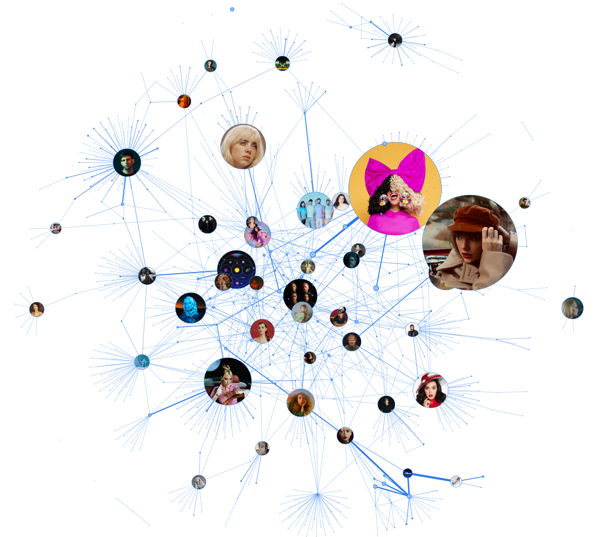

# Playlist visualizer for Spotify
Graphical representation of your favourite playlist! Generate a graph, which shows how many songs of an artists you have added (size of a node), and visualizes every songs that
two artist had recorded together (size of a )

## How to use it?
Input your data in .env file:
```
TOKEN=YOUR_TOKEN_FROM_SPOTIFY_API
PLAYLIST=ID_OF_PLAYLIST
```
You can get your token here: [Spotify API](https://developer.spotify.com/console/get-playlist-tracks/). Just click "Get Token". If you want to visualize a private playlist,
please select adequate scope. Your token should start with "BQ".

You can see yuor playlist ID by clicking Share > Copy Link To PLaylist. Your ID will be visible in the URL. (Example: [5xynfyTPMhpWEVq91TwNQz](https://open.spotify.com/playlist/5xynfyTPMhpWEVq91TwNQz?si=8d6c781f26d1420a))

Required libraries:
- pyvis
```
pip install pyvis
```

Then just run the python script:
```
python main.py
```
If the playlist is big, it may take some time, cause not to exceed rate limits every request has a 500 ms cooldown (can be easily changed)